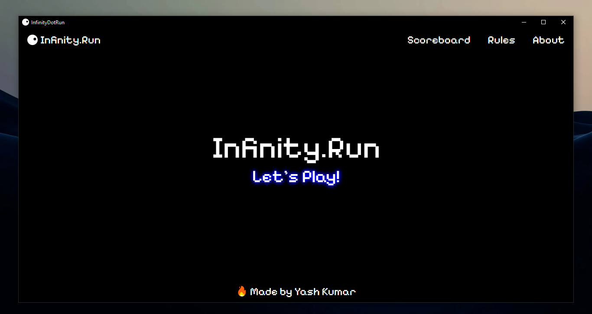
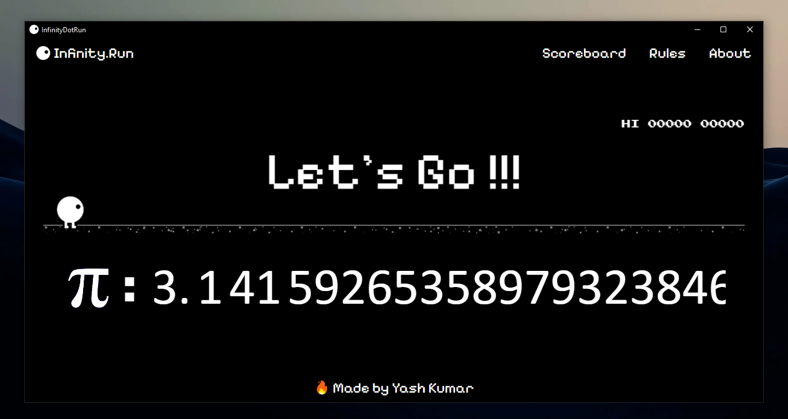
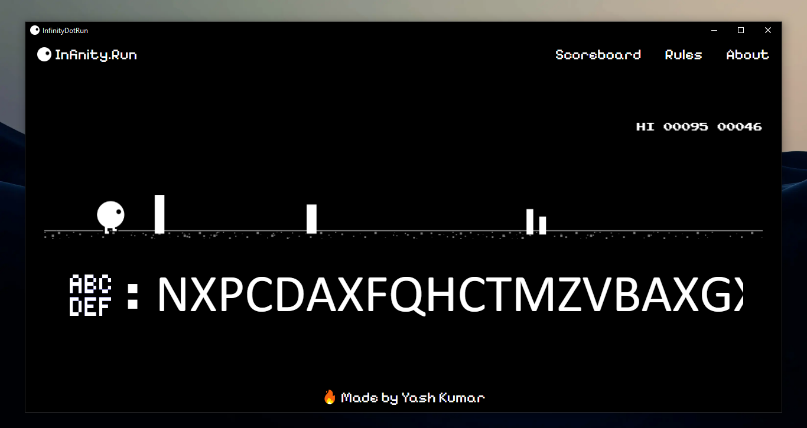
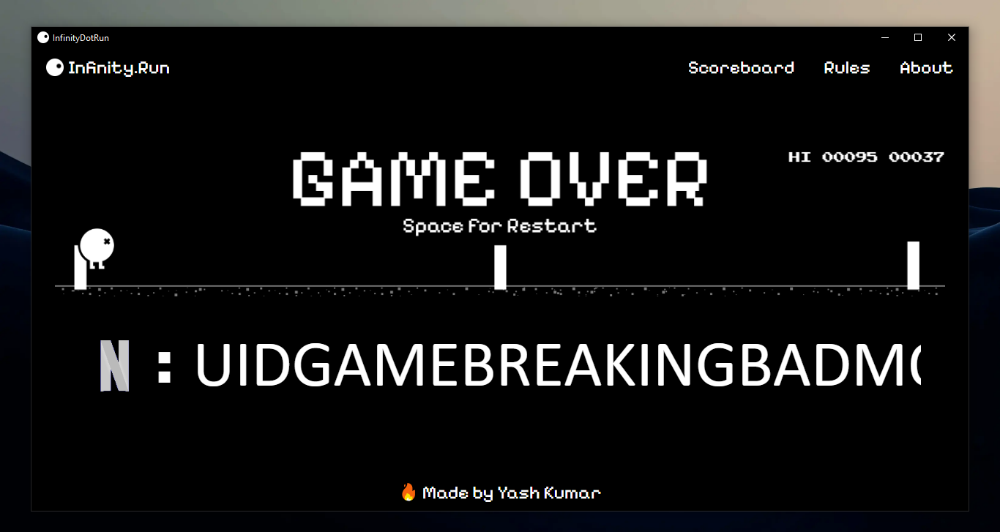

# Infinity.Run 
Welcome to the **Infinity.Run** repository!    
This project is built using React. It's an endless runner game where the player must dodge obstacles and survive for as long as possible.

---

## 🎮 Game Features

- **Endless Runner Gameplay**: Dodge obstacles by pressing correct keys and see how far you can go.
- **Dynamic Difficulty**: The game speed increases as you progress..
- **Simple Controls**: Easy to learn, hard to master.
- **Various Modes**: The game includes various modes such as Pi, root2, root3, Euler, etc.

---

## 🛠️ Customization
This project is modular and highly customizable. Here are a few ideas:

- **Change Skins**: Update the player or obstacles by modifying the assets or styles in `player.js` and in `main.js`.
- **Add Obstacles**: Introduce or add as many obstacles as you like in `main.js`.
- **Add Symbols and Values**: Add symbols and their corresponding values in the `constants.js`, `symbol.js` and `value.js`.
- **Note**: You can modify the following files to make customizations:
    ``` bash
    GameElements/ for Game components.
    src/App.css/ for styling and themes.
---

## 🚀 Getting Started

### Prerequisites

Before getting starting, ensure you have the following:

- **Web Browser**: A modern browser like Chrome, Firefox, or Edge.

- **Node.js**: [Download Node.js](https://nodejs.org/)
- **npm**: Comes with Node.js.

---

### Installation and Setup:

1. **Clone the Repository**:
   ```bash
   git clone https://github.com/yashcode4/Infinity.Run.git

2. **Install the dependencies**:
   ```bash
   npm install

3. **Start the development server**:
   ```bash
   npm start

4. **Open your browser and navigate to http://localhost:3000 to play the game.**
---

## 🚀 Run the Game

- Open the `repo` directly in your code editor.
- Start the react app:
  ```bash
  npm starts

---

## 🖥️ Desktop App (Tauri Build)

Infinity.Run is now available as a native desktop application using [Tauri](https://tauri.app/).

### 🔽 Download Executables

Choose the format based on your preference or system:

- [Infinity.Run Portable (.exe)](https://github.com/yashcode4/Infinity.Run/releases/latest)  
  Just download and play – no installation needed.

- [Infinity.Run Installer (.msi)](https://github.com/yashcode4/Infinity.Run/releases/latest)  
  Standard Windows installer – recommended.

- [Infinity.Run NSIS Installer (.exe)](https://github.com/yashcode4/Infinity.Run/releases/latest)  
  Alternative Windows installer using NSIS.

> 📦 You can find all the latest release builds under the **[Releases](https://github.com/yashcode4/Infinity.Run/releases)** section of this repository.

---

### 🛠️ Run Locally with Tauri (for Developers)

If you want to build or run the Tauri app locally:

#### 📋 Prerequisites:
- Node.js
- Rust (used by Tauri) → [Install Rust](https://www.rust-lang.org/tools/install)
- pnpm (or npm/yarn)
- Tauri CLI:
  ```bash
  pnpm dlx @tauri-apps/cli init

#### ▶️ Start the App (Development Mode):
- This opens the native Tauri window for testing and debugging.
   ```bash
   pnpm tauri:dev

#### 🏗️ Build Executables:
- For generating build:
  ```bash
  pnpm tauri:build

- Generated builds will appear in:
  ```bash
  src-tauri/target/release/bundle/

---

## 📜 How to Play
- **Start**: Press the correct key to begin.
- **Jump**: Use the correct keys to avoid obstacles.
- **Survive**: Dodge obstacles to keep going!
- **Score**: The longer you run, the higher your score.

---
## 🌟 Screenshots
### Gameplay Examples:
#### Opening:

#### Start:

#### Gameplay:

#### Game Over:


